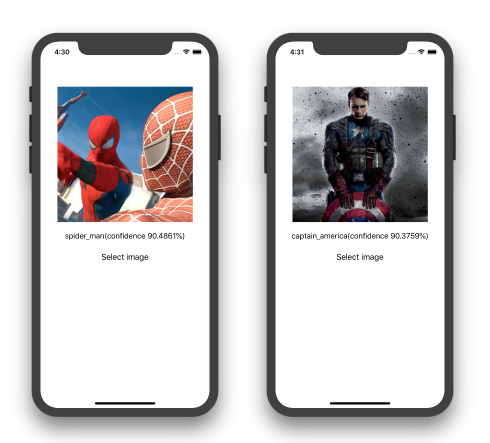

# Avengers

## Description

- Demo how to use IBM Watson and CoreML
- Read my blog post [Detecting Avengers superheroes in your iOS app with IBM Watson and CoreML](https://medium.com/flawless-app-stories/detecting-avengers-superheroes-in-your-ios-app-with-ibm-watson-and-coreml-fe38e493a4d1)

## Author

Khoa Pham, onmyway133@gmail.com

## License

**Avengers** is available under the MIT license. See the [LICENSE](https://github.com/onmyway133/Avengers/blob/master/LICENSE.md) file for more info.
